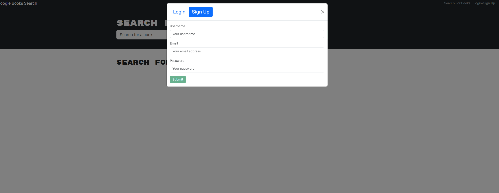
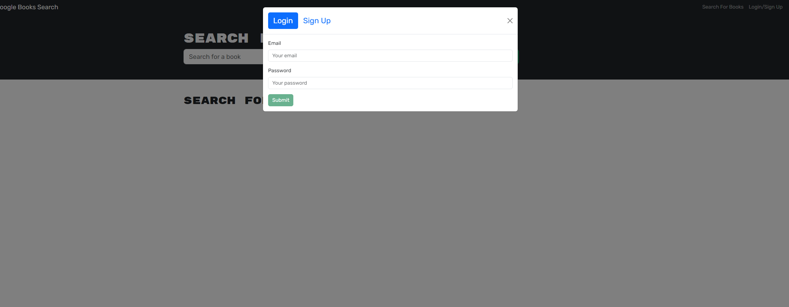
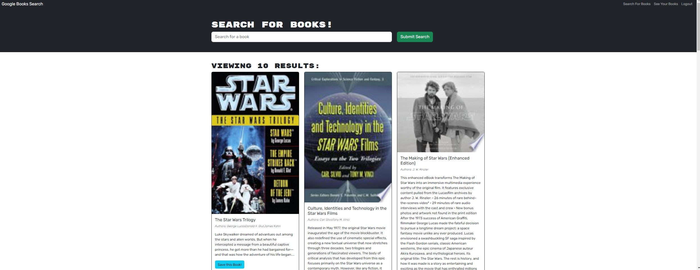
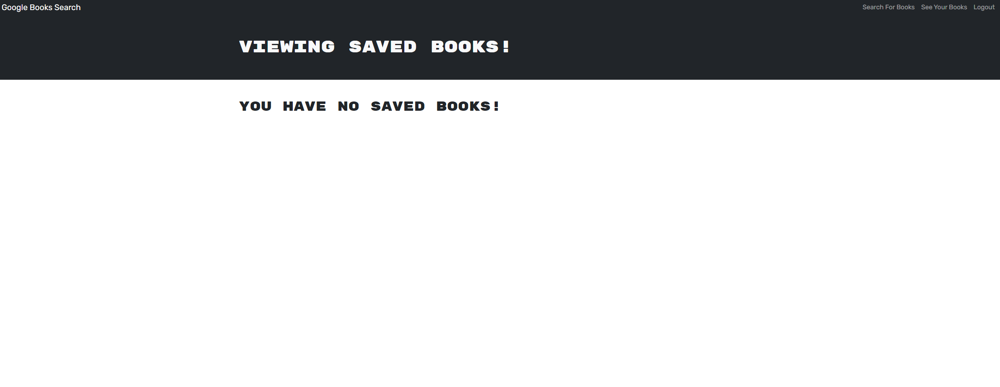
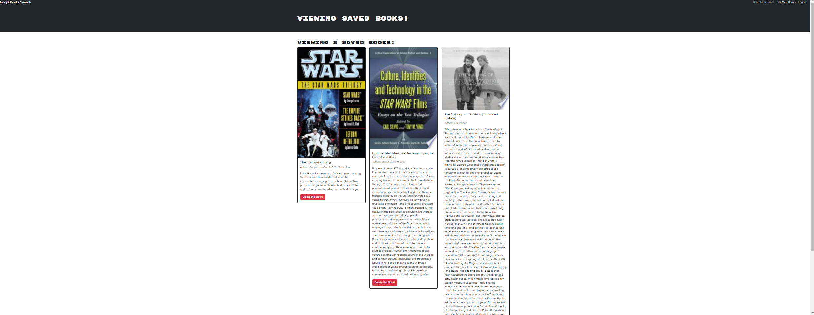

# 21 MERN: Book Search Engine

## Description:
The Book Search engine allows the user to search for book titles 10 books at a time. User will be able to save books for later use once they are logged in. 

## Table of Contents
- [Installation](#installation)
- [Usage](#usage)
- [License](#license)
- [Credits](#credits)
- [Contributing](#contributing)
- [Tests](#tests)
- [Questions](#questions)
- [CodeSource](#code Source)

## Installation

To install the app the user must first type in the command line: "npm i" to install all the files require to run the program.

## Usage
The user can search for books to save as favorites. Although it can only be save once a user is signed up or login in to save to that specified user. 
 
 
 
 
 Once the user is logged in they can click a tab on the top right to show all the saved books that the user has. Once they are on that page the user can delete the books off of that page as well.
  
 
 If no books are saved then the website will display a message saying no saved books. 
 

## License
This project is licensed under the MIT license.

Copyright (c) 2023 Richard. All rights reserved.

Permission is hereby granted, free of charge, to any person obtaining a copy of this software and associated documentation files (the "Software"), to deal in the Software without restriction, including without limitation the rights to use, copy, modify, merge, publish, distribute, sublicense, and/or sell copies of the Software, and to permit persons to whom the Software is furnished to do so, subject to the following conditions:

The above copyright notice and this permission notice shall be included in all copies or substantial portions of the Software.

THE SOFTWARE IS PROVIDED "AS IS", WITHOUT WARRANTY OF ANY KIND, EXPRESS OR IMPLIED, INCLUDING BUT NOT LIMITED TO THE WARRANTIES OF MERCHANTABILITY, FITNESS FOR A PARTICULAR PURPOSE AND NONINFRINGEMENT. IN NO EVENT SHALL THE AUTHORS OR COPYRIGHT HOLDERS BE LIABLE FOR ANY CLAIM, DAMAGES OR OTHER LIABILITY, WHETHER IN AN ACTION OF CONTRACT, TORT OR OTHERWISE, ARISING FROM, OUT OF OR IN CONNECTION WITH THE SOFTWARE OR THE USE OR OTHER DEALINGS IN THE SOFTWARE.

## Credits
Thanks to all the TA's and professors at DU. As well as the LA, graders, and askBCS.

## Contributing
Email at my email addresss to discuss in further detail about how you can contribute to the project.

## Tests

There are no test for this app as of current.
  
## Questions
If you have any questions about the repo, open an issue or contact me directly at [richard.au@cuanschutz.edu](mailto:richard.au@cuanschutz.edu). You can find more of my work at [Richard-Au1](https://github.com/Richard-Au1).

## Code Source
In package.json for main and server a learning assistant help out with swapping depencies into the right files. As well as letting me know to change a line in the vite.config.js from '/api' to '/graphql' to allow the server to connect to graphql. After sometime looking into why the books were not displaying onto the saved books page and mapping it out on the page. I check with chat gpt to see what can be done. They said to change the data to check first to see if userData.savedBooks exist first before checking length in order to display the books. 